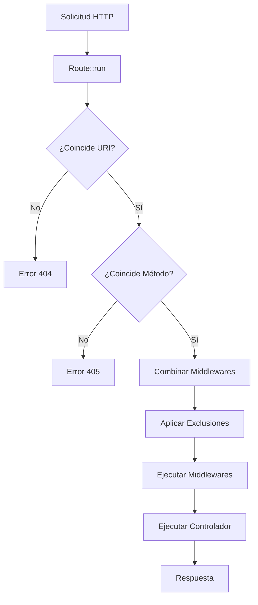

# Clase Route - Sistema de Enrutamiento

La clase `Route` es el núcleo del sistema de enrutamiento de la aplicación. Gestiona todas las rutas HTTP y despacha las solicitudes al controlador y acción correspondientes.

## Índice

- [Ubicación](#ubicación)
- [Características](#características)
- [Métodos HTTP](#métodos-http)
- [Middlewares](#middlewares)
- [Prefijos y Grupos](#prefijos-y-grupos)
- [Parámetros Dinámicos](#parámetros-dinámicos)
- [Ejemplos Prácticos](#ejemplos-prácticos)

---

## Ubicación

```
core/Route.php
```

El archivo de definición de rutas se encuentra en:

```
App/Route/_Rutes.php
```

---

## Características

| Característica | Descripción |
|----------------|-------------|
| Métodos HTTP | GET, POST, PUT, PATCH, DELETE |
| Middlewares | Globales, por grupo y por ruta |
| Prefijos | Agrupación de rutas bajo un prefijo común |
| Parámetros | Soporte para parámetros dinámicos en URIs (`:id`) |
| Closures | Soporte para funciones anónimas como acciones |
| Exclusiones | Permite excluir middlewares específicos |

---

## Métodos HTTP

### `Route::get()`

Registra una ruta para solicitudes **GET**.

```php
Route::get("/ruta", [Controlador::class, "metodo"]);
```

### `Route::post()`

Registra una ruta para solicitudes **POST**.

```php
Route::post("/ruta", [Controlador::class, "metodo"]);
```

### `Route::put()`

Registra una ruta para solicitudes **PUT** (actualización completa).

```php
Route::put("/ruta/:id", [Controlador::class, "metodo"]);
```

### `Route::patch()`

Registra una ruta para solicitudes **PATCH** (actualización parcial).

```php
Route::patch("/ruta/:id", [Controlador::class, "metodo"]);
```

### `Route::delete()`

Registra una ruta para solicitudes **DELETE**.

```php
Route::delete("/ruta/:id", [Controlador::class, "metodo"]);
```

> [!NOTE]
> Para usar PUT, PATCH o DELETE desde formularios HTML, incluye un campo oculto `_method`:
> ```html
> <input type="hidden" name="_method" value="PUT">
> ```

---

## Middlewares

Los middlewares son filtros que se ejecutan antes de que la solicitud llegue al controlador.

### Middleware Global

Aplica middlewares a **todas** las rutas de la aplicación:

```php
use App\middleware\createSectionLocationMiddleware;
use App\middleware\noIndexMiddleware;

Route::addGlobalMiddleware([
  createSectionLocationMiddleware::class,
  noIndexMiddleware::class
]);
```

### Middleware por Ruta

Aplica middlewares solo a una ruta específica:

```php
use App\middleware\AuthMiddleware;

Route::get("/admin", [AdminController::class, "dashboard"], [AuthMiddleware::class]);
```

### Middleware por Grupo

Aplica middlewares a un grupo de rutas:

```php
Route::middleware([AuthMiddleware::class])->group(function () {
    Route::get("/perfil", [UserController::class, "profile"]);
    Route::get("/configuracion", [UserController::class, "settings"]);
});
```

### Excluir Middlewares con `except()`

Excluye middlewares específicos de una ruta:

```php
// Excluye createSectionLocationMiddleware solo de esta ruta
Route::except([createSectionLocationMiddleware::class])
    ->get("/sitemap.xml", [sitemapController::class, "sitemap"]);
```

---

## Prefijos y Grupos

### Prefijo Simple

Añade un prefijo común a un grupo de rutas:

```php
Route::prefix('admin')->group(function () {
    Route::get("/dashboard", [AdminController::class, "dashboard"]); // /admin/dashboard
    Route::get("/usuarios", [AdminController::class, "users"]);       // /admin/usuarios
    Route::get("/posts", [AdminController::class, "posts"]);          // /admin/posts
});
```

### Combinando Prefijo y Middleware

```php
Route::prefix('api')
    ->middleware([ApiAuthMiddleware::class])
    ->group(function () {
        Route::get("/usuarios", [ApiController::class, "getUsers"]);    // /api/usuarios
        Route::post("/usuarios", [ApiController::class, "createUser"]); // /api/usuarios
        Route::get("/posts", [ApiController::class, "getPosts"]);       // /api/posts
    });
```

### Grupos Anidados

```php
Route::prefix('admin')->group(function () {
    Route::get("/", [AdminController::class, "index"]); // /admin
    
    Route::prefix('usuarios')->group(function () {
        Route::get("/", [UserController::class, "list"]);           // /admin/usuarios
        Route::get("/:id", [UserController::class, "show"]);        // /admin/usuarios/:id
        Route::post("/", [UserController::class, "store"]);         // /admin/usuarios
        Route::put("/:id", [UserController::class, "update"]);      // /admin/usuarios/:id
        Route::delete("/:id", [UserController::class, "destroy"]);  // /admin/usuarios/:id
    });
});
```

---

## Parámetros Dinámicos

Los parámetros dinámicos se definen con `:` seguido del nombre del parámetro.

```php
// Ruta con un parámetro
Route::get("/usuario/:id", [UserController::class, "show"]);

// Ruta con múltiples parámetros
Route::get("/categoria/:categoria/post/:slug", [PostController::class, "show"]);
```

### Recibiendo Parámetros en el Controlador

```php
class UserController
{
    public function show($id, $requestData)
    {
        // $id contiene el valor del parámetro de la URL
        // $requestData contiene los datos de la solicitud (GET, POST, etc.)
        
        echo "Usuario ID: " . $id;
    }
}
```

### Múltiples Parámetros

```php
class PostController
{
    public function show($categoria, $slug, $requestData)
    {
        echo "Categoría: " . $categoria;
        echo "Slug: " . $slug;
    }
}
```

---

## Ejemplos Prácticos

### Ejemplo 1: Rutas Básicas

```php
<?php

use App\controllers\homeController;
use App\controllers\contactController;
use Core\Route;

// Página principal
Route::get("/", [homeController::class, "index"]);

// Formulario de contacto
Route::get("/contacto", [contactController::class, "view"]);
Route::post("/contactame", [contactController::class, "contactMe"]);
```

### Ejemplo 2: CRUD Completo

```php
<?php

use App\controllers\postController;
use Core\Route;

// Listar publicaciones
Route::get("/publicaciones", [postController::class, "index"]);

// Ver formulario de creación
Route::get("/crear-publicacion", [postController::class, "viewCreatePost"]);

// Crear publicación
Route::post("/crear-publicacion", [postController::class, "createPost"]);

// Ver publicación individual
Route::get("/publicacion/:url", [postController::class, "singlePost"]);

// Editar publicación
Route::get("/publicacion/:id/editar", [postController::class, "edit"]);
Route::put("/publicacion/:id", [postController::class, "update"]);

// Eliminar publicación
Route::delete("/publicacion/:id", [postController::class, "destroy"]);
```

### Ejemplo 3: API RESTful con Autenticación

```php
<?php

use App\controllers\ApiController;
use App\middleware\ApiAuthMiddleware;
use App\middleware\RateLimitMiddleware;
use Core\Route;

Route::prefix('api/v1')
    ->middleware([
        ApiAuthMiddleware::class,
        RateLimitMiddleware::class
    ])
    ->group(function () {
        // Usuarios
        Route::get("/users", [ApiController::class, "getUsers"]);
        Route::get("/users/:id", [ApiController::class, "getUser"]);
        Route::post("/users", [ApiController::class, "createUser"]);
        Route::put("/users/:id", [ApiController::class, "updateUser"]);
        Route::delete("/users/:id", [ApiController::class, "deleteUser"]);
        
        // Posts
        Route::get("/posts", [ApiController::class, "getPosts"]);
        Route::get("/posts/:id", [ApiController::class, "getPost"]);
        Route::post("/posts", [ApiController::class, "createPost"]);
        Route::patch("/posts/:id", [ApiController::class, "updatePost"]);
        Route::delete("/posts/:id", [ApiController::class, "deletePost"]);
    });
```

### Ejemplo 4: Panel de Administración

```php
<?php

use App\controllers\AdminController;
use App\middleware\AuthMiddleware;
use App\middleware\AdminMiddleware;
use Core\Route;

Route::prefix('admin')
    ->middleware([AuthMiddleware::class, AdminMiddleware::class])
    ->group(function () {
        Route::get("/", [AdminController::class, "dashboard"]);
        Route::get("/estadisticas", [AdminController::class, "stats"]);
        
        // Gestión de usuarios
        Route::prefix('usuarios')->group(function () {
            Route::get("/", [AdminController::class, "usersList"]);
            Route::get("/crear", [AdminController::class, "createUserForm"]);
            Route::post("/crear", [AdminController::class, "storeUser"]);
            Route::get("/:id/editar", [AdminController::class, "editUser"]);
            Route::put("/:id", [AdminController::class, "updateUser"]);
            Route::delete("/:id", [AdminController::class, "deleteUser"]);
        });
    });
```

### Ejemplo 5: Rutas SEO (Excluyendo Middlewares)

```php
<?php

use App\controllers\sitemapController;
use App\middleware\createSectionLocationMiddleware;
use Core\Route;

// Estas rutas excluyen el middleware de geolocalización
// ya que son accedidas por bots de búsqueda
Route::except([createSectionLocationMiddleware::class])
    ->get("/sitemap.xml", [sitemapController::class, "sitemap"]);

Route::except([createSectionLocationMiddleware::class])
    ->get("/robots.txt", [sitemapController::class, "robots"]);
```

### Ejemplo 6: Usando Closures (Funciones Anónimas)

```php
<?php

use Core\Route;

// Ruta simple con closure
Route::get("/test", function ($requestData) {
    return "Hola Mundo";
});

// Ruta con parámetros y closure
Route::get("/saludo/:nombre", function ($nombre, $requestData) {
    return "Hola, " . htmlspecialchars($nombre);
});
```

---

## Estructura de un Middleware

```php
<?php

namespace App\middleware;

class AuthMiddleware
{
    public function handle($requestData, callable $next)
    {
        // Lógica antes de ejecutar la ruta
        if (!isset($_SESSION['user'])) {
            header('Location: /login');
            exit;
        }
        
        // Continuar con la siguiente capa (otro middleware o controlador)
        return $next($requestData);
    }
}
```

---

## Métodos Auxiliares

### `Route::getRoutes()`

Obtiene todas las rutas registradas:

```php
$routes = Route::getRoutes();
print_r($routes);
```

### `Route::reset()`

Limpia todas las rutas (útil para testing):

```php
Route::reset();
```

### `Route::getInputData()`

Obtiene los datos de entrada para solicitudes PUT, PATCH, DELETE:

```php
$data = Route::getInputData();
```

---

## Manejo de Errores

La clase Route maneja automáticamente los siguientes errores HTTP:

| Código | Descripción | Cuándo se dispara |
|--------|-------------|-------------------|
| **404** | Página no encontrada | La URI no coincide con ninguna ruta |
| **405** | Método no permitido | La URI existe pero el método HTTP no |
| **500** | Error interno | Error en middleware o controlador |

---

## Diagrama de Flujo



---

## Buenas Prácticas

1. **Agrupa rutas relacionadas** usando `prefix()` y `group()`.
2. **Usa middlewares globales** para lógica común (autenticación, logging).
3. **Excluye middlewares** donde no sean necesarios (rutas de SEO, APIs públicas).
4. **Nombra tus rutas claramente** usando verbos RESTful.
5. **Mantén el archivo de rutas organizado** con comentarios y separaciones.

---

> [!TIP]
> Para rutas que solo serán accedidas por bots (sitemap, robots.txt), usa `except()` para excluir middlewares innecesarios y mejorar el rendimiento.
